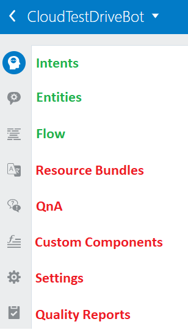
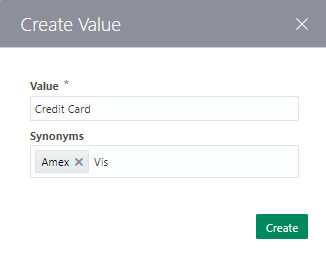

## Intelligent Bots - Building an intelligent Banking Bot ##

### About this tutorial ###

In this lab, you define a simple ChatBot and test it.
You’ll first create two intents and a few utterances and then add an entity and associate it with your intent. 
Then finally you'll train and test your bot to see how it works.
	
#### Step 1. Create a simple Banking ChatBot ####

Log in to your ChatBot Tenant instance, locate the bot called **CloudTestDriveBot** bot, press the hamburger icon and then click the **Clone** button. This will give you an identical version of the empty CloudTestDriveBot

In the **Clone Bot** dialog, name the ChatBot **CloudTestDriveBot_xx**, where 'xx' are your initials. Then, add a description and click **Create**.

You are taken to the home page for your bot. Here on the left you can see a list of icons you use to navigate to your **Intents, Entities, Flow, Components and Settings**. At this time, you have no intents.

*The segments highlited in green text is the ones we're going to focus on in this lab*

Click the second icon down **"Entities"** and notice it is pre-populated system entities. These are standard entities that can be used in your ChatBot without having to explicitly define.

#### Step 2. Add an Intent and an Entity for checking Balances ####

From your ChatBot, click the **Intent** icon and then click the green **Intent** button.

This intent will be used to find out your bank balance. Enter **Balances** as the intent name, and then provide a description. These values are automatically saved, so you do not need to explicitly save them. As you create artifacts, you may notice a message in the lower right corner that your work has been saved.

Now that you have an intent, you need some sentence examples to express what a balance is. In the Examples area add the following text: **How much money do I have in my checking account?**, followed by a return.

Add another example utterance: **How much do I owe on all my credit cards?**, followed by a return.

Include the list of example utterances below to your intent, each followed by a return. Notice that the examples do not need to be in the form of a question, they can be a statement.
-	**How much money did I save last year?**
-	**How much money do I have in all of my accounts?**
-	**Tell me my balance.**
-	**What's my savings balance?**
-	**What’s my available credit on my Visa?**
-	**What’s my balance?**
-	**What’s the current balance on my cc?**

Now that the intent is created, add an entity. Click the **Entities** icon on the left.

If you want to request the balance of an account, you would probably need to know the account that will return the balance.

Click the green **Entity button and then enter **AccountType** as the entity name and a short description.

Now that you have an entity, you need to provide some values that could be used. In our case of the account type, you would want to use values that represent accounts you could query on a balance.

In the **Configuration** area, ensure the **Type** property is set to Value List and then click the green **Value** button.

In the popup dialog, enter **Checking** as the value and **check** as a synonym (followed by a return).

Then click **Create**.

Then, add a second value named **Savings** and this time add a synonym of **save**.

Finally, add a third value named **Credit Card** and use **Amex, VISA** and **Card** as the synonyms. 

*Pro-tip: When you're adding multiple values as synonyms, hit the **Tab** button when you're done with each entry. In this case you define **Amex** -> hit **Tab** -> start with the next synonym, in this case **VISA**.* 

When finished your entity definition should look like the image below.

Now you've got an intent and an entity it works on. You need to associate the balance intent and account type entity, and it's easy to do.

Click the **Intent** icon, and on the right find the **Intent Entities** area.

Click the green **Entity** button and select **AccountType** from the list.

The entity is added and a required flag is set. You can remove the entity by clicking the **x** to the right of the entity name. Do not do remove the entity from your intent.

### Step 3. Add an Intent, Entity for checking Transferring Money ###

You’ve created one intent for checking balances, now you are going to create a second intent which will allow you to transfer money to a payee.

From your Bot, click the green **Intent** button as you did before. This intent will be used to transfer money. Enter **TransferMoney** as the intent name, and then provide a description. 

Now that you have an intent, you need some sentence examples to express what transferring money is. In the Examples area add the following 

-	**Pay Chase the minimum balance on the 15th of the month**
-	**Send $500 to Mom from Savings every month**
-	**Pay Cleo for rent on the 1st of every month using Paypal**
-	**I’d like to send Sasha $20 for lunch**
-	**Pay Lauren $15 for photos**

Now that the intent is created, add an entity. Click the **Entities** icon on the left.

If you want to transfer money the minimum information you would need is who to transfer the money to, the amount and when the transaction should take place.  You will now create an entity **ToAccount** to indicate the payee.  The currency and the date we can use built in entities.

Create a new List Entity called **ToAccount** with values according to below table. In the **Configuration** area, ensure the **Type** property is set to Value List and then click the green **Value** button.

| Values	| Synonyms |
| ------------- | ------------- |
| Lauren	| sister        |
| Shea  | daugther  |
| Mom  | mother  |
| Chase Preferred  | Chase  |
| the baby sitter |   |

As before, you need to associate the TransferMoney intent and ToAccount type entity, so as before:

Click the **Intent** icon, select **TransferMoney** and on the right find the **Intent Entities** area.

Click the green **Entity** button and select **ToAccount** from the list.

Furthermore, select **CURRECY**, and **DATE** from the list.  These are built-in entities.

### Step 5. Train and Test your ChatBot ###

In this part of the tutorial, you run the training tool on the bot. This will train the bot allowing it to understand similar user inputs to the example utterances used when building the bot.

In the upper right, click the **Train** button. This will kick off a process that will run an algorithm to take your example utterances and build the model that will be used to ascertain the intents and entities. Anytime the ChatBot platform recognizes your bot needs to be trained, it will display an exclamation point in the train button. Once the training is complete the exclamation point is replaced by a check mark.

To test the ChatBot, click the **play icon** in the upper right of the page. This takes you into the tester where you can see two tabs: Bot and Intent.
 
Click the **Bot** tab to test the bot. What you type in at the bottom in the **Message** area, is what will be sent to the bot when you click the **Send** button.

Let's start out simple to test the bot.

In the Message area, type **What's my balance?** and then click the **Send** button.

Upon the bot understanding the intent, a **Dialog Flow** is started - controlling the flow of the converation with the user. However, due to time restrictions of this lab, we will not explore the **Dialog Flow** component of Intelligent Bots.

Since the account type wasn't specified the bot presents you with three options. Click one of the three options and the text showing your account type and a balance is displayed.

Now, let's try a message that includes the account type.

Please finish each flow if you are testing the Bot, or hit **Reset** to create a new session and avoid confusion with an incomplete flow from a previous session. 

Now click the **Intent** tab.  We are going to now test only the intent and entity resolution rather than a whole conversation flow.

In the message area type **What is the balance on my Amex?** and press **Send**.

Here you can see a confidence percentage that the message is a particular intent. You also see that the account type entity is recognized as a credit card. 

In the message area type **Send $50 to Mom tomorrow** and press **Send**.

Here you can see a confidence percentage that the message is a particular intent. You also see that the ToAccount entity is recognized as Mom, and Currency and Date are correctly resolved as well. 
